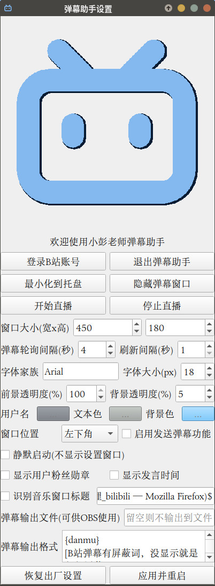

# QDanmu

跨平台的B站直播弹幕机，支持Linux/Windows/MacOS系统，快速查看自己直播间的B站弹幕


## 特性

- 手机扫码即可登录
- 半透明悬浮窗口，不影响鼠标点击
- 可显示弹幕发送者昵称、发送时间及粉丝牌
- 窗口全屏的游戏中依然可见
- 可显示当前正在播放音乐名
- 可供 OBS 实时读取显示弹幕文本
- 颜色、透明度、字体、窗口位置等均可配置
- 主播可以发送回复弹幕

未来可能会加入的特性：

- 支持打开其他人的（不是自己的）直播间



## 安装与使用

```bash
python -m pip install -r requirements.txt
python danmu.py
```

## 附加小工具

```bash
python live.py 75287  # 在 VLC 中打开 live.bilibili.com/75287
```

## 提示

- 设置会保存到 .bilibili-options.json
- 登录信息会保存到 .bilibili-cookies.json
